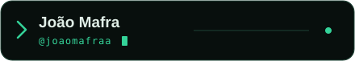

  

  

  Computer Science student at <strong>CESAR School</strong>. 
  Building projects across different programming languages and exploring new technologies. 
  <strong>Open to work and new opportunities.</strong>

  

<h2 align="center">Languages</h2>

  

Java · Python · C · C++ · CSS · JavaScript

<h2 align="center">Tools &amp; Environment</h2>

  

Linux &middot; Git · GitHub · VS Code · Arduino IDE

<h2 align="center">
  
</h2>

  
  

<h2 align="center">Let's connect</h2>

  
  
  

